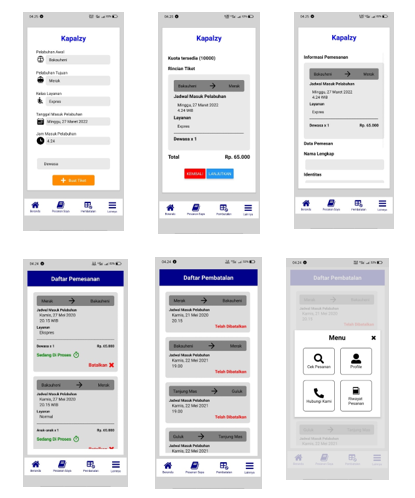

# UTS_PAM

Nama : M. Riski Aziz  
NIM : 119140160  
Kelas : PAM RC   

Link Download Aplikasi : https://drive.google.com/file/d/1Qg1cPT7fk5ufeO7NNqTEmoRcuIvl6gAl/view?usp=sharing  
Limk Video Demo : https://youtu.be/h9f-lT-zpaQ  

## Instalasi

1.  Dengan File APK  
    dapat diinstal dengan mendownload file apk yang tertera pada folder file_apk,  
    atau kunjungi link berikut : https://drive.google.com/file/d/1Qg1cPT7fk5ufeO7NNqTEmoRcuIvl6gAl/view?usp=sharing  

2.  Dengan React Native  
    • Instal terlebih dahulu node.js versi 12 atau lebih (Jika sudah memiliki, skip bagian ini)  
    • Download semua file pada folder project  
    • Gunakan terminal lalu lakukan perintah berikut  
    -> cd project  
    -> npm start  

## Deskripsi Aplikasi

• Aplikasi digunakan untuk proses pemesanan tiket kapal untuk mereka   yang akan menyebrang antar pelabuhan  
• Aplikasi terdiri dari 4 menu yaitu Beranda, Daftar Pemesanan, Daftar Pembatalan dan Lainnya  
• Beranda merupakan menu awal aplikasi, yang berisikan prosesi pemesanan tiket  
• Daftar Pemesanan merupakan menu yang menampilkan history dari pemesanan tiket  
• Daftar Pembatalan merupakan menu yang digunakan untuk membatalakan pemesanan jika tiket yang dipesan salah  
• Lainnya merupakan menu yang terdiri dari profile (untuk melihat   profile pengguna), Cek Pemesanan (untuk mengecek pemesanan)  ,hubungi kami (untuk terhubung ke customer service jika terdapat   masalah pemesanan) dan riwayat pemesanan (untuk melihat history pemesanan)

## Cara Kerja Aplikasi

• Lakukan pengisian data untuk membuat tiket kapal, kemudian ikuti langkah selanjutnya dengan mengisi data-data hingga proses pemesanan tiket selesai 
• Pantau pesanan dapat dilihat di menu Daftar Pesanan  
• Jika ingin melihat pesanan apa saja yang telah dibatalkan dapat menlihat ke menu Daftar Pembatalan  
• Tiket yang telah terpesan dapat di lihat di menu lainnya kemudian riwayat tiket  
• Menu profil dan hubungi customer service dapat di akses di menu lainnya  

## Pembuatan Aplikasi

1. Aplikasi terdiri dari 7 halaman dengan nama halaman Beranda, daftarPemesanan, daftarPembatalan, rincian, informasi, profile dan history. Yang masing-masing antarmukanya dapat dilihat pada gambar berikut :

2. Lakukan Pembuatan 7 File Javascript, untuk membuat masing-masing halaman. Seperti pada gambar berikut :

3. Lakukan Pembuatan masing-masing halamn agar sesui dengan spesifikasi yang telah ditetapkan. Adapun kodenya dapat dillihat pada link github yang tertera di awal.

4. Selanjutnya buatlah Navigasi antar halaman, dalam ini saya menggunakan jenis navigasi stack navigator. Ke tujuh halamn di masukkan ke dalam stack navigator.

5. Karena menggunakan stack navigator maka tab menu di bagian bawah kita buat secara manual. Ini dapat dilihat pada file menu.js di github yang tertera di awal

6. Proses pembacaan file json, dalam hal ini kami membuat sebuah file json bernama basisData.json. Pembacaan cukup lakukan import file json dengan cara :
    Import \* as datas from “../basisData.json”
   Pembacaan ini akan digunakan untuk proses pengisian data di beranda, penampil daftar pembatan, daftar pemesanan dan history.

7. Passing parameter, dilakukan dengan variabel yang diberi nama route. Dari route akan mengambil route.params kemudian nama label parameter kita.

8. Penggunaan Modal, digunakan untuk menampilkan sebuah halaman tanpa perlu bernavigasi. Ini di gunakan untuk menampilkan menu lainnya. Ketika menu tersebut di klik akan menampilkan sebuah halaman, namun kita tidak berpindah navigasi.

9. Penggunaan DateTimePicker, untuk menampilkan bentuk kalender dan jam sesuai contoh pada figma. Library ini digunakan pada halaman beranda.

10. Penggunaan axios, digunakan untuk melakukan post data json dan update data json. Axios di instal agar dapat mengakses localhost kita untuk memproses file json.

## Sumber

1. https://reactnative.dev/
2. https://reactnavigation.org/
3. https://icons.expo.fyi/
4. https://reactnative.dev/docs/modal
5. https://www.npmjs.com/package/@react-native-community/datetimepicker
6. https://www.npmjs.com/package/axios
7. PPT Perkuliahan Pemrograman Aplikasi Mobile 2022
